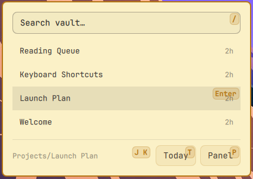
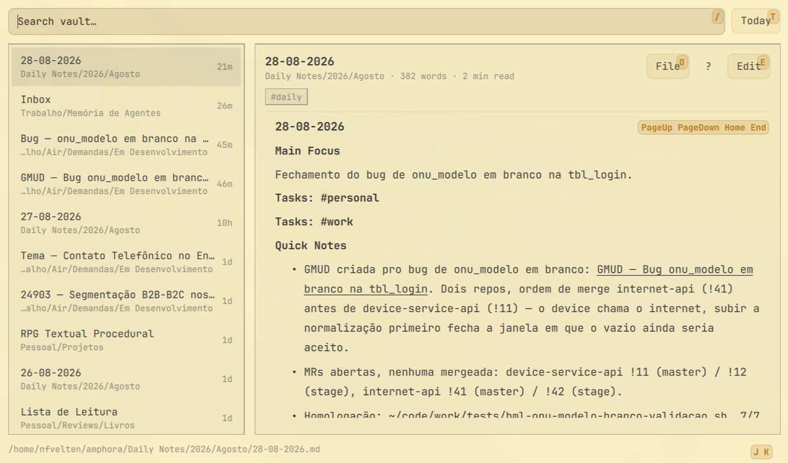

# Vault

Vault is a native Omarchy plugin for browsing, searching, reading, and editing
Markdown files from a local vault. It provides a compact bar widget and a full
panel with keyboard navigation, Markdown rendering, and direct editing.

## Requirements

- Omarchy with Quickshell plugin support
- `find`, `rg`, `head`, and a writable Markdown vault

The default vault path is `~/amphora`. Set an absolute `vaultPath` in the
plugin settings to use another directory.

## Installation

```bash
omarchy plugin add https://github.com/harbefas/omarchy-vault.git --enable
```

The plugin can also be installed from a local checkout:

```bash
omarchy plugin add /path/to/omarchy-vault --enable
```

After installation, place the widget in the bar through Omarchy's plugin
settings. The full panel can be opened from the widget or with the configured
panel shortcut.

To open the compact widget from anywhere, add this optional binding to
`~/.config/hypr/bindings.lua`:

```lua
o.bind("SUPER + ALT + V", "Vault quick view", "omarchy shell -q harbefas.vault.widget toggle")
```

Then reload the shell:

```bash
omarchy restart shell
```

## Usage

- Click a note or press `Enter` to open it.
- Use `j`/`k` or the arrow keys to move through notes.
- Press `/` to search.
- Press `Enter` to open the selected note in the full panel.
- Press `e` to edit the current note and `Esc` to return to reading.
- Press `n` (or `Ctrl+N`) to create a note. A name like `Pessoal/Ideias`
  creates the folder along with the file.
- Press `d` (or `Ctrl+D`) to open today's daily note, creating it from the
  vault's section template when it does not exist yet.
- While editing, `Ctrl+B`, `Ctrl+I`, `Ctrl+K`, and `Ctrl+L` insert bold,
  italic, a Markdown link, and a `[[wikilink]]`.
- Press `q` or `Esc` to leave the current surface.

If the open note changes on disk while an edit is unsaved, autosave stops and
the panel offers `Reload` or `Keep mine` instead of picking a side.

Markdown content is rendered in the reader. Edits are written directly to the
selected file only after the explicit save action.

## Removal

```bash
omarchy plugin remove harbefas.vault
```

Removing the plugin does not delete or modify any Markdown files in the vault.

## Preview

Compact widget:



Full Markdown panel:



## License

MIT. See [LICENSE](LICENSE).

`EditorMutations.js` comes from [Omawrite](https://github.com/omacom/omawrite),
also MIT licensed.
